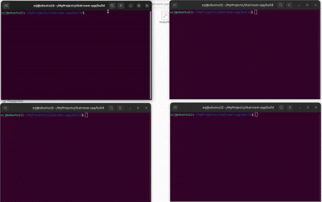

# chatroom-cpp

基于 C++ 的命令行聊天室，使用 TCP 套接字与多线程实现。服务端负责转发消息，多个客户端可同时在线并互相看到聊天内容。



## 功能

- 多客户端同时连接、实时广播聊天消息
- 按用户 ID 分配终端颜色，区分不同发言者
- 用户加入 / 离开时的系统提示
- 发送与接收分离为两个线程，输入时仍可接收他人消息
- 输入 `#exit` 可正常退出并通知其他用户

## 环境要求

- Linux（使用 POSIX 套接字 API）
- C++ 编译器（支持 C++11 及以上，需支持 `<thread>`）
- [CMake](https://cmake.org/) 3.10+

## 编译

```bash
git clone <你的仓库地址>
cd chatroom-cpp
mkdir build && cd build
cmake ..
make
```

编译完成后在 `build/` 目录下生成可执行文件 `server` 与 `client`。

## 运行

**1. 启动服务端**（默认监听 `0.0.0.0:10000`）：

```bash
./server
```

**2. 启动客户端**（可开多个终端窗口）：

```bash
./client
```

按提示输入昵称，连接成功后即可在 `You:` 提示符后输入消息并回车发送。

**3. 退出聊天室**

在客户端输入：

```
#exit
```

## 使用示例

```
终端 1                    终端 2                    终端 3
./server                  ./client                  ./client
                          Enter your name: Alice    Enter your name: Bob
                          You: hello                You: hi Alice
Alice: hello                                        Bob: hi Alice
```

服务端终端会同步打印所有聊天与进出房消息，便于调试。

## 项目结构

```
chatroom-cpp/
├── CMakeLists.txt   # 构建配置
├── server.cpp       # 服务端：接受连接、广播消息
├── client.cpp       # 客户端：发送 / 接收线程
├── 演示.gif         # 运行演示
├── README.md
└── LICENSE
```

## 实现说明

| 组件 | 说明 |
|------|------|
| 传输协议 | TCP（`SOCK_STREAM`） |
| 默认端口 | `10000` |
| 客户端连接地址 | `127.0.0.1`（可在 `client.cpp` 中修改） |
| 单条消息最大长度 | 200 字节（`MAX_LEN`） |
| 广播帧格式 | 定长 200 字节用户名 + 4 字节颜色 ID + 200 字节消息体 |

服务端对每条广播固定发送 **404 字节**，客户端通过 `recv_all` 循环读取直至收满，避免 TCP 粘包 / 半包导致解析错位。

用户名特殊值 `#NULL` 表示系统消息（如「xxx has joined」），此时客户端不显示发送者前缀。

## 注意事项

- 请先启动 `server`，再启动 `client`。
- 修改代码后需重新编译，并重启服务端与所有客户端。
- 终端需支持 ANSI 转义序列才能正确显示颜色。
- 当前客户端写死连接本机 `127.0.0.1`；若需局域网访问，请同步修改 `client.cpp` 中的地址，并确保防火墙放行 10000 端口。

## 许可证

本项目采用 [BSD 2-Clause License](LICENSE)。
